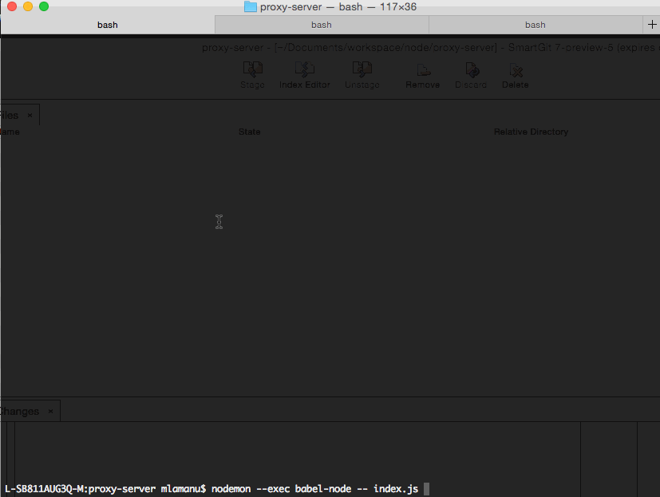

# Proxy Server

This is a Proxy Server for Node.js submitted as the [pre-work](http://courses.codepath.com/snippets/intro_to_nodejs/prework) requirement for CodePath.

Time spent: 3 hours

Completed:

* [X] Required: Requests to port `8000` are echoed back with the same HTTP headers and body
* [X] Required: Requests/reponses are proxied to/from the destination server
* [X] Required: The destination server is configurable via the `--host`, `--port`  or `--url` arguments
* [X] Required: The destination server is configurable via the `x-destination-url` header
* [X] Required: Client requests and respones are printed to stdout
* [X] Required: The `--logfile` argument outputs all logs to the file specified instead of stdout
* [] Optional: The `--exec` argument proxies stdin/stdout to/from the destination program
* [] Optional: The `--loglevel` argument sets the logging chattiness
* [] Optional: Supports HTTPS
* [] Optional: `-h` argument prints CLI API

 